```{r setup, include=FALSE}
knitr::opts_chunk$set(echo = FALSE)
```

# 1 Location

This tab is used to do exploratory data analysis for different locations. User can select different graph by using the dropdown list on the top.

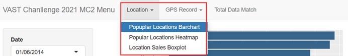

## 1.1 Popular Locations Barchart

User can select different date by using the Date dropdown list to view the bar chart for number of transactions in different locations and date. The order of location is sorted decreasingly to provide a more straightforward intuition about which locations are more popular.

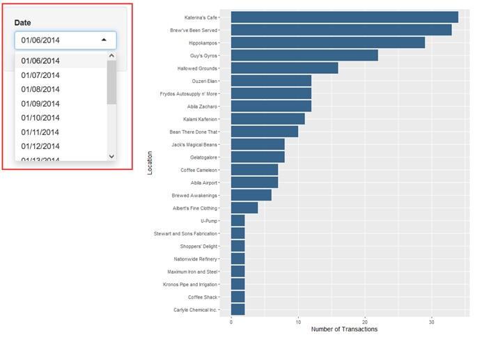

## 1.2 Popular Locations Heatmap

This graph displays the heat map for different locations to show the distribution of sales in different hours of day to detect the peak hours. User can select different date by using the Date dropdown list. When hover a specific rectangle in this graph, it will show the location name, hour and the corresponding number of transactions in this hour.  

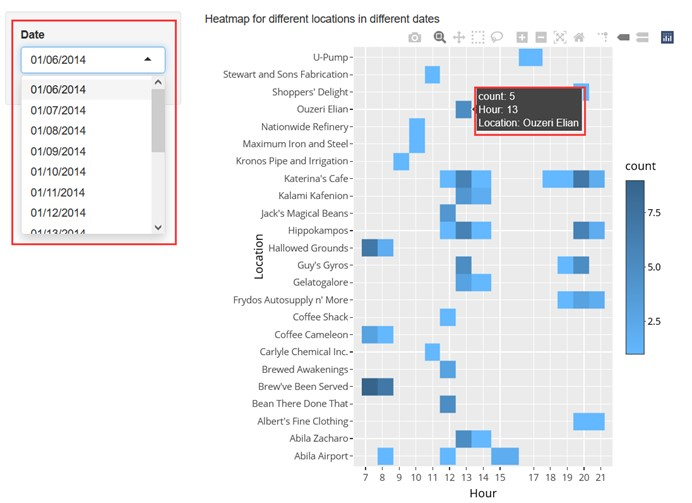

The overall 14-days sales bar chart is also displayed in this page to provide an overview for the most popular locations in these 14 days.

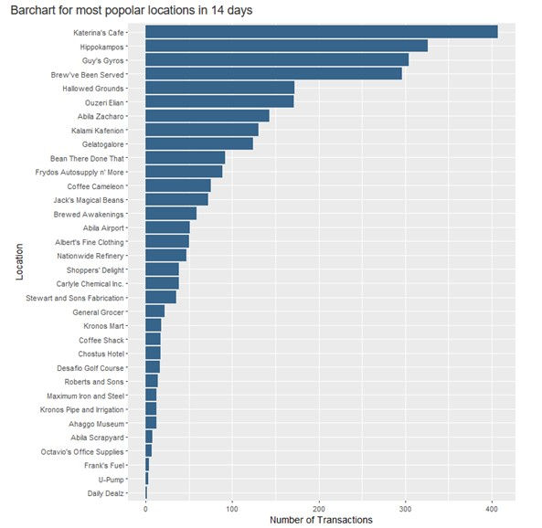

## 1.3 Location Sales Boxplot

This graph is used to show the distribution of sales in a specific location during these 14 days to detect suspicious outliers. User can use the Location dropdown list to select the box plot for different locations. When hover on a specific point in this plot, it will show the day, price and corresponding credit card or loyalty card number for the selected transaction.

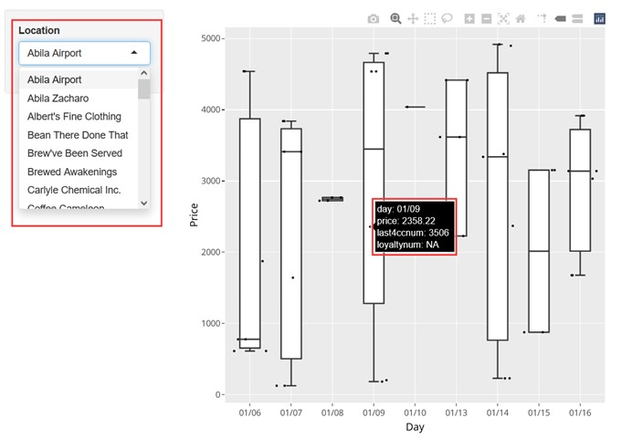

# 2 GPS Record

This tab is used for visualization of timeline and maps using gps record data. User can select different graph by using the dropdown list on the top.

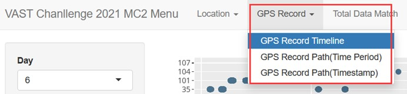

## 2.1 GPS Record Timeline

This graph can be used to detect those driving record at suspicious time and provide an overview of the daily driving time period for different car id. User can use the Day dropdown list to select different days. When hover a specific point in this graph, it will show the corresponding card id and timestamp for this record. 

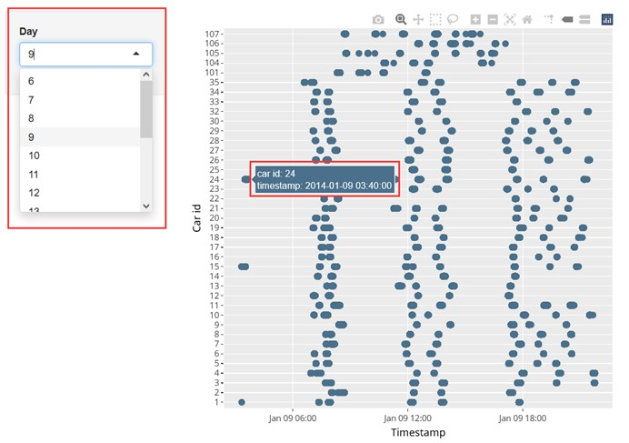

## 2.2	GPS Record Path (Time Period)

This map can show the driving path in a selected timeslot. User can use the Car ID and Day dropdown list to choose different car and day. The Start Hour and End Hour is used to set the timeslot. For example, if user want to view driving path between 7 a.m. and 1 p.m., then the start hour should be set at 7 and the end hour should be set at 13.

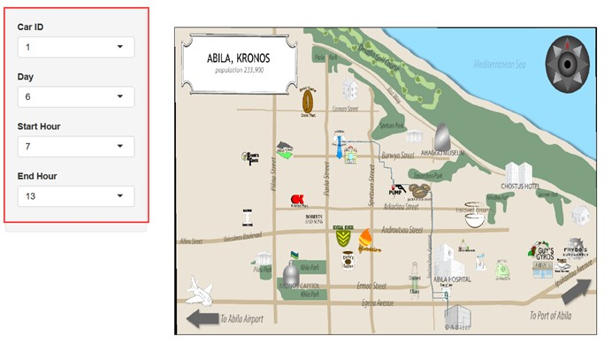

## 2.3 GPS Record Path (Timestamp)

This map shows the driving path in a short timeslot to detect the possible card owner and car id relationship. User can select different days by the Day dropdown list. The Hour and Minute dropdown list is used for setting the timestamp user would like to detect. For example, if user want to view the exact location of each car in Jan 6 8:00 a.m., then the hour should be set at 8 and minute should be set at 0. In this scenario, the map will show the related driving path between 8:00 and 8:03. The 3 minutes time window is set to better incorporate all those related gps records.

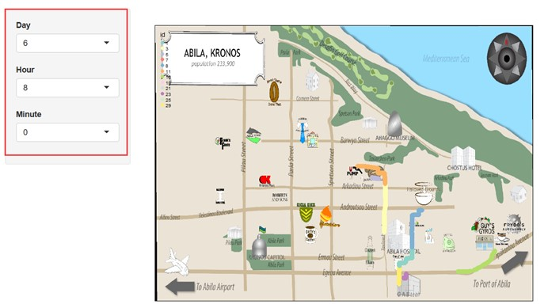

The data table for credit card data is also shown in this page to provide user some convenience if they want to refer to the data table and select a specific timestamp.

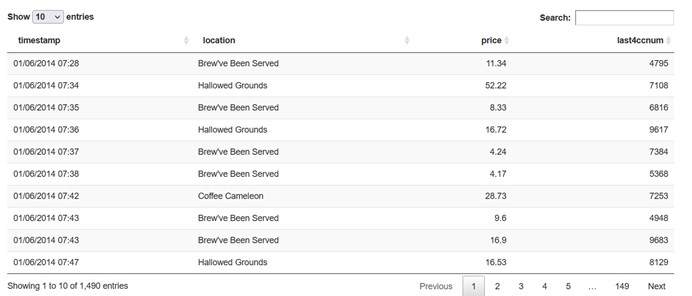

# 3 Total Data Match

This tab shows the data table for final result of matching card owner with corresponding car id and some other personal information.

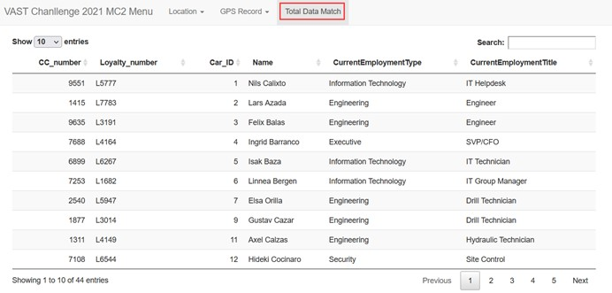