```{r setup, include=FALSE}
knitr::opts_chunk$set(echo = FALSE)
```
## Abstract

Geospatial analytics is used to add timing and location to traditional types of data and to build data visualizations. It is a growing discipline providing important analytics in a wide range of applications in different industries, such as government application in health, weather, electric utilizations providers to do tracking, optimize routines and schedules. 
A shiny application was developed following a data analytics workflow process of exploratory data analysis to allow user to uncover the hidden patterns in an effective way.

## 1. Introduction
This project is to conduct the data visualization on the Vast-challenge 2021 mini-challenge 2 to give some insights on some abnormal activities. The background of this challenge is that some employees from company GAStech located in Abila is missing and we need to find out the abnormality by analysis the credit card purchase history data and gps tracking data. 
The analysis was mainly performed by exploratory spatial data analysis (ESDA) and exploratory data analysis (EDA). We combined the geo-spatial data with aspatial attribute data and develop a shiny application to provide interactive analysis. 
The data sets given are the 2 weeks data before some employees’ missing date. Including employees’ credit card and loyalty card transaction records, gps records, and car assignment. The company cars which are approved for both personal and business use, and the vehicles are tracked periodically if they are moving. 
An assignment was done as a groundwork for an interactive Shiny app. The purpose of this assignment is to explore the packages that can be used and finding how interactivity can be added to the application to help the users in exploring the data. Then a shiny application has been built to provide an interactive analysis.

## 2. Motivation of the application
Our research and development efforts were motivated by the general lack of effective and easy to use web-enabled geospatial analytics tool for discovering patterns in the map with gps data. It aims to provide car movement track with a dedicated date and car ID on a specific time or a time period.
By using the free application R-shiny to build a free open-source tool without requiring users to code or understand R.

(1)	To be able to create a map that can display gps tracks in specific date and time by different car ID.
(2)	To be able to plot a heatmap with information on frequency of attending by different date, time and location.
(3)	To be able to plot a car movement timestamp by different car ID over different date time.


## 3. Review and Critic on past works
The same challenge was performed in 2014. Hence, we can get some clue of method has been used in our analysis. 
A background map of this town is necessary as we have the gps data on the map to view the track of the cars’ movement. Most of the analysis has applied the map as the background map, and applied the gps data with different car ID and timelines on the map. To plot out the map with gps point on the surface, we will use tmap packages in the following paragraphs to plot the gps data. tmap package designed to generate the thematic maps with great flexibility. The syntax for creating plots is like that of ggplot2,  but tailored to maps.
Another method which can be applied in our analysis is to plot a heat map timeline by transactions in different locations. This can help us to observe the pattern of normal activity in certain period also some abnormality activity can be observed. Heat maps allow us to simultaneously visualize clusters of samples and feature, where data values are transformed to color scale. The most basic heatmap we can build with R and ggplot2, using the geom_tile() function. Input data must be a long format where each row provides an observation. At least 3 variables are needed per observation: x as position on the X axis; y as position on the Y axis; fill with the numeric value that will be translated in a color.

## 4. Design Framework
The application uses R-language, using standard R packages to plot the graph and using Shiny to webify the codes for simplicity and provides options or interactivity. Following packages has been applied: 'shiny', 'ggplot2', 'readr', 'clock','dplyr', 'plotly', 'tidyverse','raster', 'sf','tmap' and 'shinythemes'.

### 4.1	Data Preparation

The following datasets are provided:\

*	GPS tracking data (Timestamp, Car ID, latitude, longitude)
*	Credit card data for GASTech employees (timestamp, location, price, last 4 digits of credit card number)
*	Loyalty card data for GASTech employees (timestamp, location, price, loyalty card number)
*	Car assignment data which lists employee, their Car ID, and their position at GASTech
*	Geospatial files for the city and country which provide context for the GPS data.

### 4.2	User Interface Design
Our structure of R shiny dashboard contains three parts: header, sidebar, and body, which allows interactive bivariate and correlation analysis to be performed under the exploratory data analysis. It consists of three major views namely: map, graphics and table, depicting different aspects of the data to the user.


(1) Location
*	Popular Locations- Barchart \
For popular location exploration, the total number of transactions at different locations are displayed by a bar chart. Applying the day filter we can see top popular locations in specific days.\
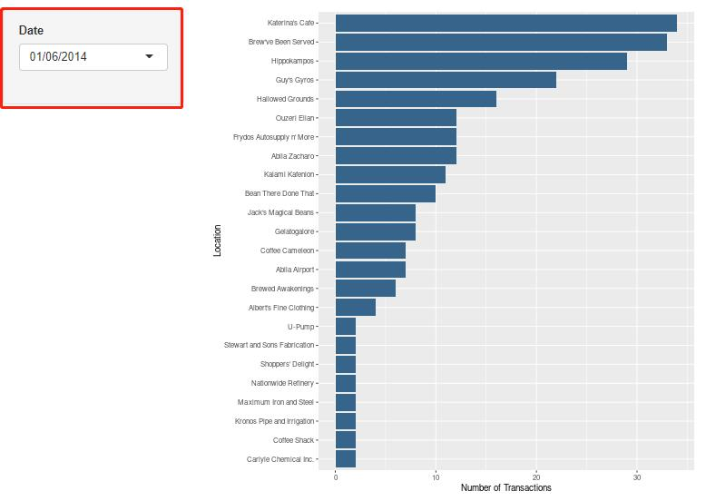{width=80%}
* Popular Locations- Heatmap \
A heatmap is used here to show the distribution of transactions in different days to detect the peak hour of different locations. We get the popular location names from the result of previous part and select the corresponding transaction data. 
	  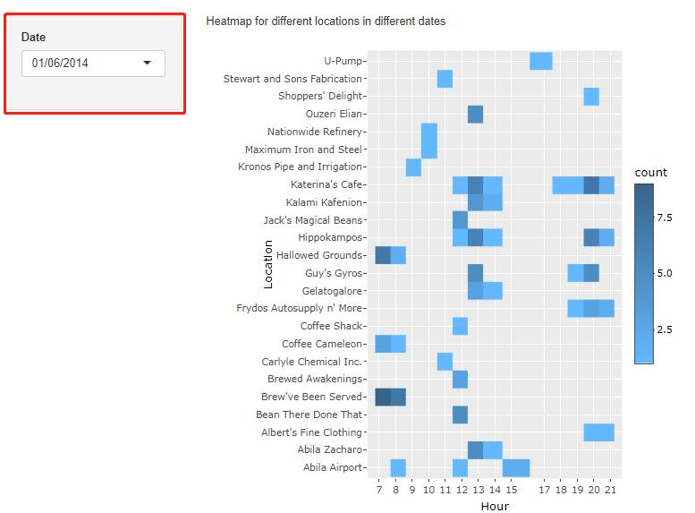{width=80%}
	  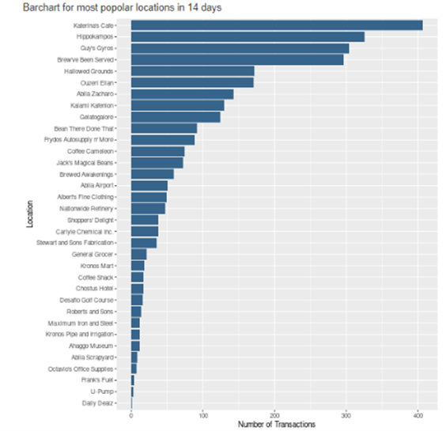

* Location Sales- Boxplot \
For popular location exploration, the total number of transactions at different locations are displayed by a bar chart. 

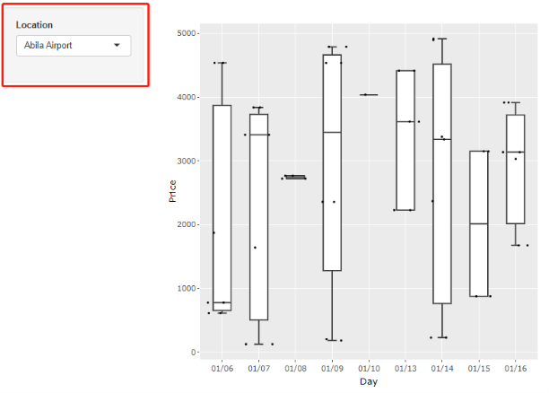

(2) GPS Record
*	GPS Record Timeline – Scatter plot \
Since we want to detect anomalies in these locations, we not only cares about their total sales but also want to know the amount of each order. A box plot is designed to show the distribution of price of each order. A new column day is added since we want to see that distribution in different days.

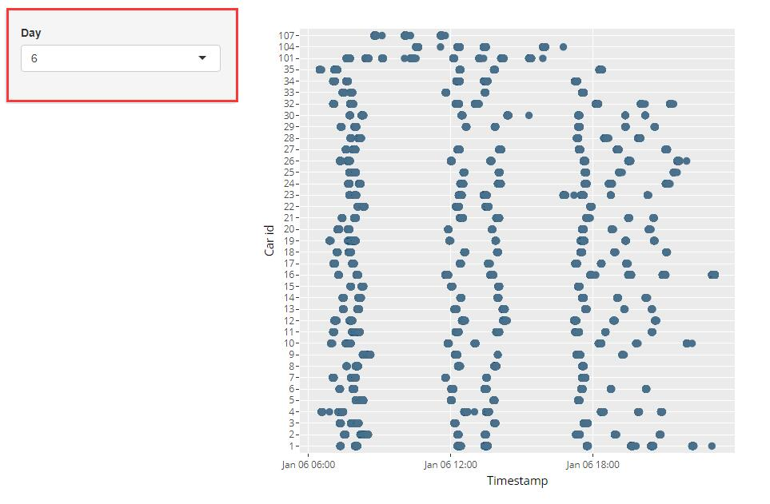

*	GPS Record Path – Time Period \
GPS timeline can show different car ID appears in different timestamp, filter by day. so in this way we can clearly see which time period cars have activities the most and also observe the abnormal activities during suspicious time period such as 2am to 4am.

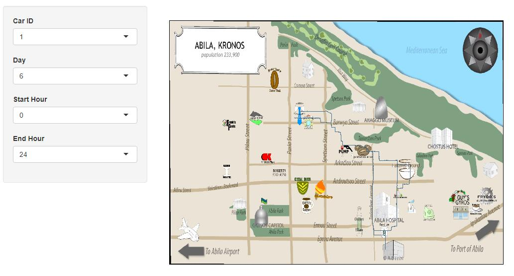

*	GPS Record Path – Timestamp \
GPS record path plot can work for visualization of path for different car ID, we can filter car ID and specific day, start hour and end hour. In this way we can see who hangout frequently and what specific time period and location they pass by.

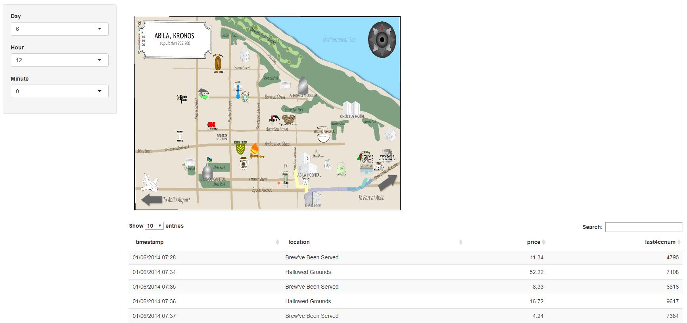


(3) Total Data Match \
GPS Record timeline is not effective because we hardly see the points or GPS track in specific time, so we add one more graph for timestamp. In the table below we can clearly see the purchasing record which contains the time point, location, price and corresponding credit card last four number.

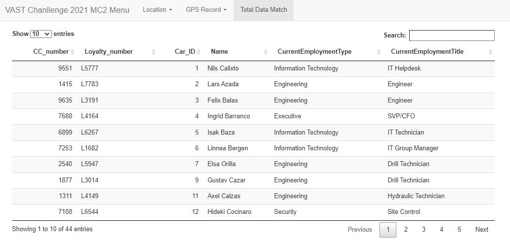

Finally we use the data table to infer the owners of each credit card and loyalty card, matched with car ID as well as employment type and title. The relationships between employees can clearly shown on the table too.

## 5. Demonstration

### 5.1 To investigate the most popular locations over different time period


When plot the Calendar Heat map, we can see the high-density points are fall in 7 to 8 am, 12 to 1pm and 19 to 20 pm. 7 to 8 am in the morning, most people went to Brew’ve been served, followed by Hallowed Grounds, coffee cameleon, abila airport and kronos Mart.
12 to 1 pm in the noon, most people went to dinning venues to have lunch. But we still observed a few people went to Carlyle Chemical Inc., Stewart and Sons Fabrication Chostus Hotel, Desafio Golf Course, Nationwide Refinery, Ahaggo Museum.  
From dinner time 7 pm to 8 pm, most people went to dinning venues to have dinner.However, one people went to abila Zacharo, and two went to Roberts and Sons.

### 5.2	To investigate the transaction amount over locations in last 14 days.

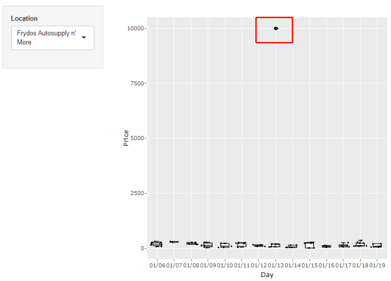


Auto supply n’ More has one very strange transaction in Jan 13. The average order price is around 200 to 300 in this location, but we can see the price of this suspicious transaction reached 10000, which is nearly 50 times of the average amount. If this is not caused by operating error, then that may involve money laundering for those kidnappers.

The suspicious transaction we detected before is made by credit card 9551. After visualizing the locations this person frequently goes, we found one daily routine of this person is to stop off at Hallowed Grounds to grab some coffee before work. Since we don’t successfully match this credit card with its corresponding car owner, we can only match the daily activity pattern of this person with the gps path data and the car owner of car 8 (Lucas Alcazer) is the most likely one.

### 5.3	To identify the potential relationship

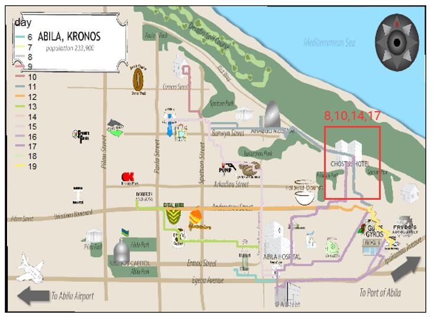


Elsa Orilla (car id 7) and Brand Tempestad (car id 33) may be in a relationship. They show up at Chostus Hotel together multiple times (in Jan 8, 10, 14, 17). According to the gps data, we can see that both of them drive their own car and most of the time they don’t come from the same places, so it is more likely that they have an affair instead of being couples.

### 5.4	Suspicious Activities
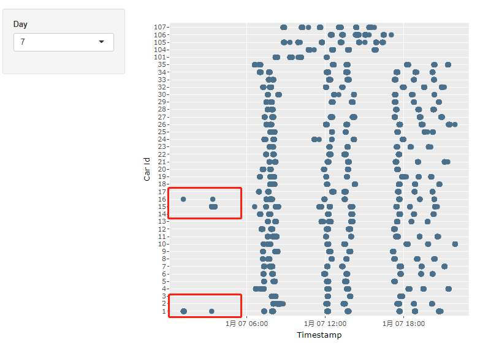

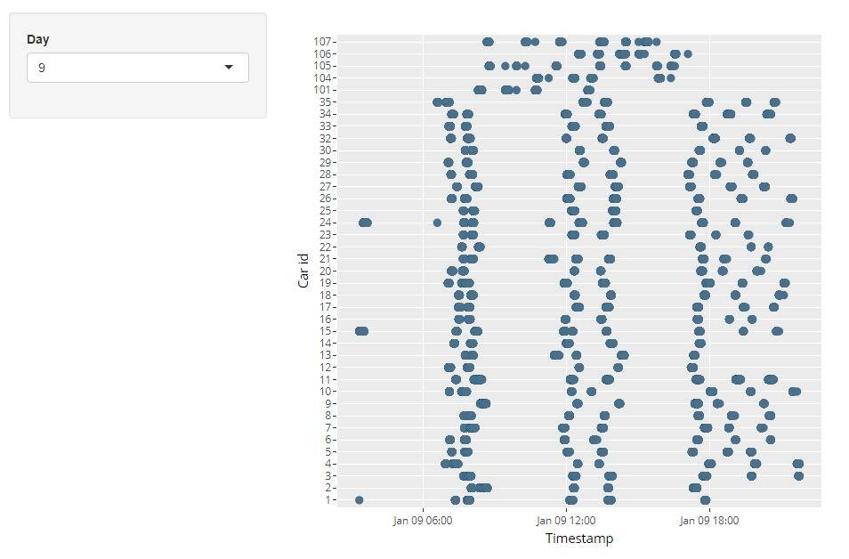
Nils Calixto (car id 1), Loreto Bodrogi (car id 15), Isia Vann (car id 16) and Minke Mies (car id 24) drives in the late night in Jan 7, 9, 11, 14, 16, nearly every other day. Coincidentally, Loreto, Isia and Minke are all work at the security department.

## 6. Discussion
RStudio is an Integrated Development Environment for R, a programming language for statistical computing and graphics. The application uses the free and open-source R language that offering a thriving programming environment for statistical and graphical analysis. In this data visualization challenge, we played as visual analytics experts to identify which GASTech employees made which purchases and identify suspicious patterns of behavior. We learned to cope with uncertainties that result from missing, conflicting, and imperfect data to make recommendations for further investigation.

## 7. Future work
Regarding to the social relationship between employees, it would be easier to identify if we can visualize who are in the same department. Given the data sources provided, we should also identify potential informal or unofficial relationships among GASTech personnel if combined with timestamp because we can infer from their common activities during specific time periods.