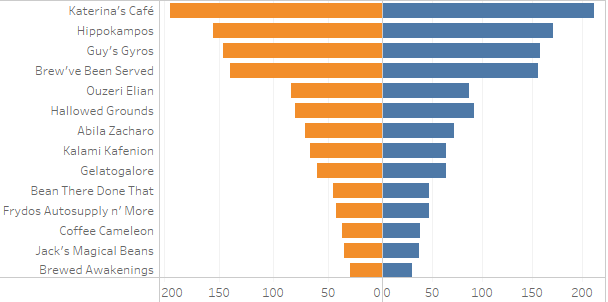
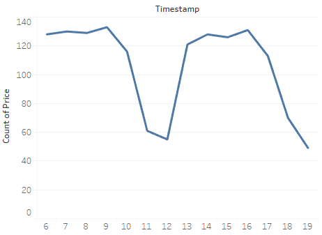
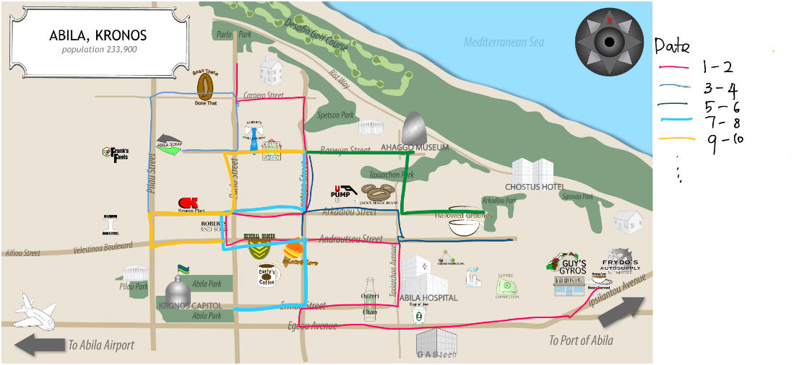
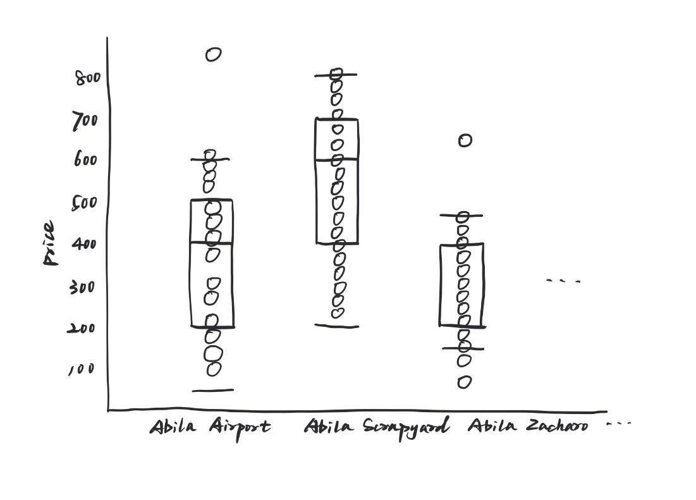

```{r setup, include=FALSE}
knitr::opts_chunk$set(echo = FALSE)
```

# 1.0 Introduction 

In the roughly twenty years that Tethys-based GAStech has been operating a natural gas production site in the island country of Kronos, it has produced remarkable profits and developed strong relationships with the government of Kronos.  

In January, 2014, the leaders of GAStech are celebrating their new-found fortune as a result of the initial public offering of their very successful company. In the midst of this celebration, several employees of GAStech go missing. An organization known as the Protectors of Kronos (POK) is suspected in the disappearance, but things may not be what they seem.\


# 2.0 Objectives 

This project aims to analyze the movement and tracking data for GAStech company’s employees who are driving company cars for their personal and professional usage for the two weeks before their disappearance. With the GPS tracking data and credit card spending on each merchant, we can find out the abnormalities and suspicious behaviors, which will give us some insight into missing employees. \


# 3.0 Data Description 

The following datasets are provided: \

* GPS tracking data (Timestamp, Car ID, latitude, longitude) \

- Credit card data for GASTech employees (timestamp, location, price, last 4 digits of credit card number) \

- Loyalty card data for GASTech employees (timestamp, location, price, loyalty card number) \

- Car assignment data which lists employee, their Car ID, and their position at GASTech \

- Geospatial files for the city and country which provide context for the GPS data. \

# 4.0 Proposed approach 

**Identify popular location by transaction times**\
Using the credit and loyalty card data to identify the most popular locations, sorted by descending order.\
 \


**Figure out popular transaction date**\
Try to figure out when these locations are popular and observe abnormal situations\
\


**Movement track by date**\
With map plot with Gps data, we can observe the car movement for last 12 days , colored by different date.\
\


**Consumption Amount Distribution for Each Location**\
We intend to visualize the consumption distribution of every location within one specific day, try to find a pattern and detect suspicious outliers.\
\


**Credit Card Consumption Timeline**\
We aim to draw a consumption timeline for every location within one day to find the sequence of transactions in order to detect the informal relationship among card owners.\

\


# 5.0 Proposed R Packages

Package Name|Description
---|:---
Shiny|Interactive web applications for data visualization 
ggplot2|tidyverse data visualization package  
ggmap|Visualize the spatial information of static maps 
leaflet|To create maps within the application 
tmap|For static and interactive maps 